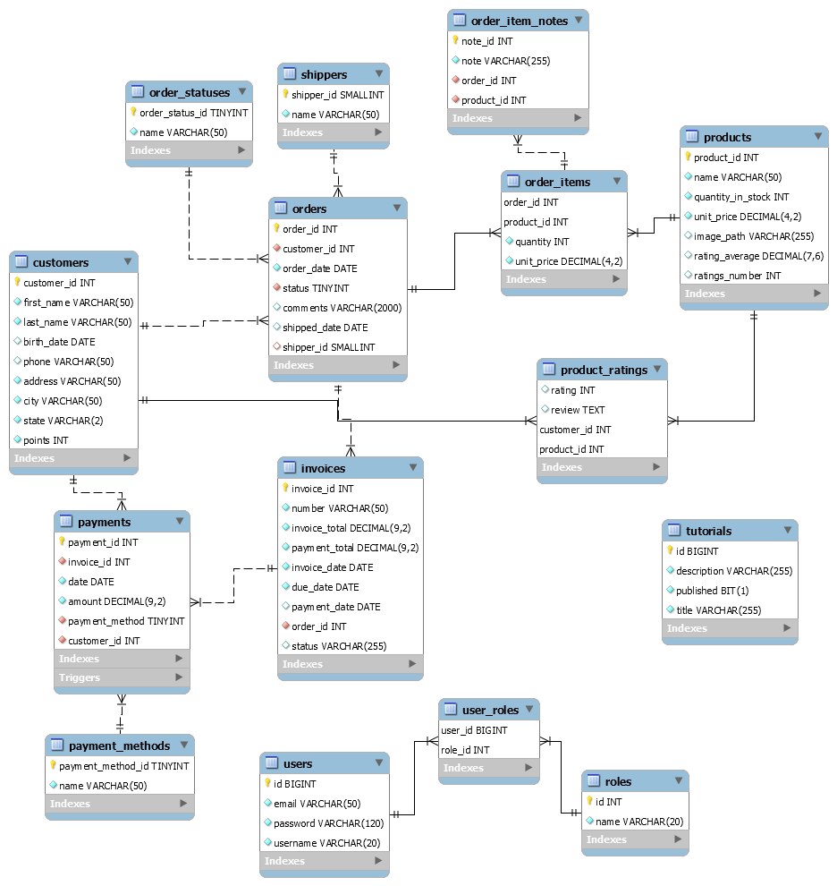

# demo web shop server

- This is a Spring Boot Server demo project.
- Each branch is implementing some new feature.

## branches sequence:
- helloworld
- CRUD-tutorials
- swagger-DATA-REST
- exceptionHandling
- pagination
- integration_tests
- CI-CD
- httpClient  
- sorting
- profiles
- custom-queries
- spring_security
- JDBC-Communication
- MappingTheWholeDatabase
- Invoices_Orders
- payments
- CORS

## MySQL database:

